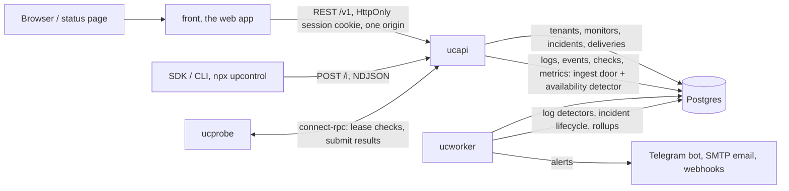

# Architecture map

How the upcontrol core fits together: the three binaries, every internal
package, the data flows, the storage layout, and what the front and CLI
touch. Written for a reader who wants to know what runs where and who writes
what, without walking the tree.

## How the pieces talk

Six runtime pieces, one contract, no hidden paths:



| Component | What it is responsible for |
| --- | --- |
| front | The web app (React + Vite): the account app and the public status pages. It talks to ucapi only, on the same origin, with an HttpOnly session cookie. |
| ucapi | The public door: the `/v1/*` API, public and hook surfaces, the schemaless ingest endpoint `POST /i`, and the ProbeService the probe fleet calls. It owns the whole ingest pipeline into Postgres and all auth doors. It enqueues deliveries, and with `--with-worker` (`UC_WITH_WORKER`, the default on a self-hosted install) it also runs the background jobs in-process: every job takes an advisory lock, so replicas stay safe either way. |
| ucworker | The background driver: the delivery queue (Telegram, Discord, Slack, email), expired-batch purging, the notification scanner, the log detector orchestrator and the heartbeat window job. Every job runs under a Postgres advisory lock, so N replicas never duplicate work. |
| ucprobe | The stateless check runner: leases checks from ucapi, runs each through the SSRF-guarded HTTP executor, submits results back. It holds no database credentials and stores nothing. |
| Postgres | The only store: the system of record (tenants, monitors, incidents, deliveries, entitlements) and the telemetry (logs, events, checks, metrics, series_1m). |
| SDK / CLI | `npx upcontrol` and `@upcontrol/sdk` (MIT): the installer wires an app up, the SDK's `track()` never throws and never blocks, everything goes to `POST /i` as NDJSON. |
| Delivery channels | Telegram bot, SMTP email, Slack, Discord, any webhook. A channel is a destination, not a rule engine. |

### Folders

```
back/    Go services: ucapi (API + ingest), ucworker (delivery, detection), ucprobe (checks)
front/   The web app (React + Vite)
db/      Postgres migrations (goose)
cli/     npx upcontrol installer, @upcontrol/sdk, the agent skill  [MIT]
infra/   docker-compose, Caddy, install.sh
```

`back/api/openapi.yaml` is the contract: both sides generate from it, and a
hand-written type on either side is how the two start disagreeing silently.

## Binaries

**ucapi** is the public-facing service. It listens on one HTTP port and serves
the OpenAPI API under `/v1/*`, the anonymous surfaces under `/public/*` and
`/hooks/*`, and the intentionally schemaless ingest endpoint `POST /i` (aliased
as `POST /v1/event`). On the same port it mounts the connect-go ProbeService
that the probe fleet calls. It owns the whole ingest pipeline (decode, scrub,
normalize, seq, cardinality, batcher into Postgres), all auth doors
(magic link, Google, Telegram Mini App), the analytics recorder, the Telegram
bot long-poll, and the `ucapi migrate` subcommand that applies schema
migrations before the app starts. It enqueues deliveries, and with
`--with-worker` (`UC_WITH_WORKER`; the default on a self-hosted install, off
otherwise) it runs the background jobs in-process from `internal/worker` as
well, so a self-host deployment is one container instead of two. That is safe
because every job takes a non-blocking Postgres advisory lock and skips when
another instance holds it, replicas included.

**ucworker** is the background driver. It listens only on `GET /health`. Every
job it runs takes a Postgres advisory lock so N replicas never duplicate work:
the delivery queue worker (alert channels: Telegram, Discord, Slack, email via
the agent or SMTP),
expired-batch purging, the error-log notification scanner, the log
detector orchestrator (error-rate incidents), and the heartbeat window job
(a missed ping is a failed check). The error-log and detector jobs read the
telemetry tables in Postgres, which is always configured, so they always
start.

**ucprobe** is the stateless check runner. It listens only on `GET /health`,
holds no database credentials (enforced by a depguard lint rule), and runs one
loop: ask ucapi's ProbeService for a batch of checks, execute each through the
SSRF-guarded HTTP executor, submit the results back. It stores nothing.

## Package map

Check marks are from `go list -deps` per binary. `gen/api` is in no binary: it
is the generated OpenAPI type source, imported only by the contract test and
regenerated by the CI drift gate.

| package | purpose | api | worker | probe |
|---|---|:-:|:-:|:-:|
| gen/api | generated OpenAPI types (contract test only) | | | |
| gen/pg | sqlc-generated Postgres queries | x | x | |
| gen/rpc/probe/v1 | protoc-generated probe RPC messages | x | | x |
| gen/rpc/probe/v1/probev1connect | generated connect-go handler and client | x | | x |
| internal/account/auth | sign-in doors: magic link, Google, Telegram Mini App | x | | |
| internal/account/session | session cookie manager over the session table | x | | |
| internal/analytics | first-party product analytics recorder, UA and GeoIP resolution (database installed by the deployment, see below) | x | | |
| internal/api | HTTP handlers and the ingest pipeline wiring | x | | |
| internal/channel/notify | per-channel notification settings model | x | x | |
| internal/channel/telegram | Telegram bot: Mini App door, alert action buttons | x | | |
| internal/deliver | delivery queue worker and channel implementations | x | x | |
| internal/detect | log detector orchestrator: windows, baselines, incident actions | | x | |
| internal/detect/availability | availability state machine (consecutive-failure confirmation) | x | | |
| internal/detect/detectors | pure detector logic returning fire/no-fire decisions | | x | |
| internal/detect/errorlog | error-log notification scanner over error fingerprints | | x | |
| internal/detect/suppression | fire suppression: cooldown, maintenance, post-deploy | | x | |
| internal/discover | bounded host discovery behind the anonymous check | x | | |
| internal/heartbeat | the ping route and the missed-window job: a heartbeat is a check the customer's job submits | x | x | |
| internal/incident | incident lifecycle: open/close, notify enqueue, frozen log slice | x | x | |
| internal/incident/triage | the incident card verdict: facts computed by code, and the title | x | | |
| internal/ingest | the POST /i handler: pipeline assembly and receipt | x | x | |
| internal/ingest/batcher | telemetry insert batching on size, age and the 1/sec-per-key flush floor | x | | |
| internal/ingest/cardinality | per-field distinct-value cap with the sentinel value | x | x | |
| internal/ingest/decode | wire-format sniffer: NDJSON, syslog, OTLP, Sentry, more | x | x | |
| internal/ingest/normalize | decides whether a message names an event stored in `events` (the deploy family and `install_verified`) | x | x | |
| internal/ingest/scrub | server-side secret scrubber (defense in depth; UC_SCRUB=0 on self-host only) | x | x | |
| internal/migrate | migration runner: goose for Postgres | x | | |
| internal/notify/mailer | sign-in and invitation mail rendering and transports | x | x | |
| internal/platform/app | process skeleton: run setup, signals, teardown budget | x | x | x |
| internal/platform/config | environment config loading and loud validation | x | x | x |
| internal/platform/health | liveness/readiness with TTL-cached dependency checks | x | x | x |
| internal/platform/logging | slog setup: JSON in prod, text in dev | x | x | x |
| internal/platform/shutdown | concurrent teardown coordinator with a shared deadline | x | x | x |
| internal/probe/executor | the HTTP check executor (the only probe code that touches the network) | x | | x |
| internal/probe/guard | SSRF guard: private, CGNAT and unspecified ranges blocked | x | | x |
| internal/ring/query | QueryBuilder: the only permitted read path to the logs table | x | x | |
| internal/ring/seq | per-project seq block allocator (two-instance guarantee) | x | | |
| internal/rpc | connect-go ProbeService: Lease, SubmitResults, ReportBlind | x | | |
| internal/source/webhook | Stripe, GitHub and Vercel webhooks into the events table | x | | |
| internal/storage/pg | Postgres pool, api_key resolver, instance settings | x | x | |
| internal/storage/pgstore | telemetry writer and reader (logs, events, checks, metrics, the series_1m upsert) over the pg pool | x | x | |
| internal/worker | the background jobs, every one under an advisory lock: delivery queue, purge, reaper, error-log scan, heartbeat, detection. Called by ucworker always, and by ucapi with --with-worker | x | x | |

## Data flows

1. **Ingest.** Entry: `api.WireIngest` builds the pipeline, `Ingester.Handle`
   serves `POST /i`. Hops: internal/api (key auth via storage/pg resolver,
   idempotency) -> ingest/decode (sniff and decode the body) -> ingest/scrub
   (server-side re-scrub of the message and every attribute value; a
   self-hosted operator may turn this off with `UC_SCRUB=0`, which config
   refuses without `UC_SELF_HOSTED=1`) ->
   ingest/normalize (decide whether the message names an event stored in
   `events`: the deploy family or `install_verified`; keep `level_raw` as the
   client sent it and map `level`) -> ingest (stamp the fingerprint, FNV-64a
   of the masked scrubbed message, what ErrorGroups and the error-log
   scanner group on) -> ingest (cap attributes: at most 64 keys kept in sorted
   order, keys at most 256 bytes, values at most 8192, trimmed and tallied,
   never a refusal) -> ingest/cardinality (cap unseen distinct values) ->
   ring/seq (lease a seq block per project) -> ingest/batcher (flushed on
   size, age and a one-insert-per-second-per-key floor) -> storage/pgstore
   (batch INSERT into logs, a copy of classified event rows into events, and
   the series_1m upsert). The
   receipt means the batcher accepted the row; there is no fsync before it,
   so it is not a durability claim.

2. **Checks.** Entry: `rpc.ProbeService.Lease` on ucapi. Hops: internal/rpc
   (lease due monitors, upsert probe_node) -> ucprobe runProbeLoop ->
   probe/executor (SSRF-guarded HTTP check) -> internal/rpc SubmitResults
   (write checks, upsert monitor_facts) -> detect/availability (the pure
   consecutive-failure state machine, run INSIDE ucapi's SubmitResults, not
   in ucworker) -> incident (open on fire, close on recovery; freeze a log
   slice at open, enqueue one delivery per interested channel) -> ucworker's
   deliver.Worker (lease the queue row, compose, send) -> channel
   implementations (Telegram, Discord, Slack, email agent or SMTP). The plan
   sketch placed detection in ucworker; only the log-based detectors
   (internal/detect) run there on their own ticker. Availability detection of
   check results runs in ucapi, synchronously with result submission.

3. **Sign-in.** Entry: `auth.MagicLink.ServeHTTP` on `POST /v1/auth/magic-link`.
   Hops: account/auth request (normalize the email, IP-capped, issue a code
   stored hashed in magic_link_code) -> notify/mailer (SendCode over the
   configured transport) -> account/auth redeem (verify, mark redeemed before
   anything else, ensure person and account) -> account/session (create the
   session row with a hashed random token) -> the httpOnly cookie. Google and
   Telegram Mini App sign-in are separate handlers in account/auth that end at
   the same session manager.

4. **Heartbeat ping.** Entry: `GET|POST /public/ping/{token}` on ucapi.
   Hops: internal/heartbeat (resolve the token to the monitor; a ping is a
   passing check, and the facts say so) -> one checks row written with
   region 'heartbeat' -> monitor_schedule.next_due_at pushed to now +
   interval + grace (grace defaults to the interval) -> incident (an open
   incident for the monitor closes, like a website check recovering).

5. **Heartbeat miss.** Entry: ucworker's heartbeat job, every minute under
   the same advisory lock as every other job. Hops: internal/heartbeat
   (monitors whose monitor_schedule.next_due_at has passed; the miss sets it
   to now + interval) -> a failed checks row with threshold 1 ->
   incident.Lifecycle opens an incident like a failed website check ->
   deliver.Worker leases and sends it. LeaseDueMonitors excludes heartbeats,
   so ucprobe never leases one.

## Storage

Read-only inventory of `db/`: one store, Postgres, one migration
(`001_init`), with the binary that writes each table ("ucapi+ucworker"
means both do). "No writer in the core" means exactly that: the table
exists, the queries around it may exist, but no binary writes it in this
repo.

**Postgres, system of record**: alert_channel, api_key, ingest_batch,
monitor, monitor_facts, monitor_schedule, person, project, project_seq,
session, source_connection, status_page, tenant, tenant_member,
webhook_seen (ucapi); delivery_attempt (ucworker);
delivery_queue, incident, incident_slice, incident_update
(ucapi+ucworker); error_alert_state (ucworker); install_token,
magic_link_code, magic_link_ip, telegram_invite, web_visitor,
instance_setting (ucapi, sealed values); probe_node (ucapi, on probe
lease); key_usage_log, plan_entitlement. Nothing about money: the hosted
product's billing sidecar owns its own tables outside this schema.

**Postgres, telemetry** (written through internal/storage/pgstore):

- `logs`: range-partitioned by `ts`, one partition per UTC day
  (`logs_YYYYMMDD`). ucworker's hourly `log-partitions` job covers the days
  from the widest `plan_entitlement.window_hours` plus a day up to three days
  ahead, and drops the ones behind that floor. Since wave 7 that floor IS the
  retention model — currently 31 days, the same on every plan. A partition it cannot name
  (001's `logs_today`, an operator's own) is never dropped.
  `level_raw` keeps the level exactly as the client sent it, capped at 32
  bytes, and `fingerprint` is computed at ingest as FNV-64a of the masked
  scrubbed message.
- `series_1m`: maintained by an UPSERT at each batcher flush
  (pgstore.BumpSeries); the detector's median/MAD reads it.
- `events` (the batcher's event copies and the webhook handler), `checks`
  (ucapi on result submission), `metrics` (ucapi via the batcher) and
  `web_events` (ucapi analytics recorder): ordinary Postgres tables.

**Day partitions ARE the retention model** (wave 7). The seq ring's
visibility boundary is gone: nothing ever wrote the line ledger, so the
cutoff was always 0 and the filter always a no-op. What actually bounds
retention is the `log-partitions` job's floor, and nothing else.
`project_seq` is untouched and still allocates seq blocks.

## Front

Each page in `front/src/pages` and the `lib/client.ts` calls behind it. Pages
that only mount a panel name the panel; the panel owns the calls.

- Channels: channels, channelsWrite (create, delete, test), delivery (poll
  the queued test's outcome).
- IncidentDetail: incident.
- Incidents: incidents.
- Logs: the page mounts LiveLogsPanel, which calls logs.
- MonitorDetail: monitors (list, patch, delete).
- Monitors: the page mounts MonitorList (monitors.list), which mounts
  MonitorOnboarding (publicCheck, monitors.create).
- PublicStatus: publicStatus (by slug).
- Settings: me, keys, rotateKey, installToken, channels,
  instance (putTelegramBot, putSMTP, deleteSMTP), statusPage (get, put).
- SignIn: auth.magicLink (request and redeem), me.
- Sources: sources, sourcesWrite (connect, setPaused, delete), incidents.
- StatusPage: statusPage (get, put), monitors.

## CLI

- `cli/installer` (npm package `upcontrol`): the one-command installer,
  `npx upcontrol`. Installs the agent skill, pins the SDK, provisions the key
  into a gitignored .env, verifies the chain. Published to the public npm
  registry.
- `cli/sdk` (npm package `@upcontrol/sdk`): the zero-dependency push library
  (track, flush, console and winston mirrors, client-side scrubbing).
  Published to the public npm registry.
- `cli/plugin`: the agent skill's single source of truth (SKILL.md plus
  reference topics). Not published anywhere itself: the installer's build
  copies it verbatim into `cli/installer/skill/` so the installer tarball is
  self-contained and version-locked.

## Removed in wave 1

Wave 1 shrank the tree without changing behaviour: every comment block was cut
to at most two lines (back/internal/api + cmd/ucapi 9321 to 8436 lines;
ai/account/analytics/channel/deliver/notify 12193 to 11137, including
mailer/smtp.go 88 to 40; ingest/ring/detect/incident/probe/source/storage/
platform/rpc/migrate + cmd/ucworker + cmd/ucprobe 12382 to 11361; front/src +
front/e2e 15646 to 13397; cli 2738 to 2622), and the following dead or unused
code was deleted.

- Unwired detectors in `internal/detect/detectors` and their tests: Absence,
  Latency, Divergence, NewFingerprint, BurnRate, BurnRateDecision (13 tests
  deleted with them; formatPct and formatFloat stay, ErrorRate calls them).
- SMTP helpers in `internal/notify/mailer/smtp.go`: NewSMTP, the base field,
  WithSignInBase, SendCode, SendInvite. SMTP.Send stays (dynamic.go builds
  it directly).
- `NewWithoutGuard` in `internal/probe/executor`; its test uses become the
  `&Executor{}` zero value.
- `Limiter.Distinct` in `internal/ingest/cardinality` and the assertion that
  used it.
- Front: unused exports and barrel lines (Wordmark, hasJson, prettyJson,
  SourceCard, seven icons, overview, invalidateAllApiData, CHANNELS_BASE);
  unused exported types left over from the commercial fork (Plan, Billing,
  Account, Project and 15 more deleted from `lib/types.ts`, 12 more export
  keywords dropped from types still used in their own files); 76 unused
  CSS-module classes and the whole SourceCard.module.css, keeping only the
  dynamically built ones.
- CLI: the installer exports skillTargets, DEFAULT_ENDPOINT and CliMode lost
  their unused `export` keyword.

## Removed in wave 2

Wave 2 executed the verified wave-1 candidates without behaviour change except one flagged
bug fix. Lane line counts: api zone 8436 to 8384; account/auth zone 11077 to 11074;
worker/storage zone 11361 to 11337; front 13397 to 13382; cli unchanged (audit only).
github.com/google/uuid moved from the indirect block to a direct dependency (go mod tidy).

- internal/api: intToStr deleted, five call sites now strconv.FormatInt; parseUUID
  rewritten on encoding/hex; emailLocal rewritten on strings.LastIndexByte.
- The three hand-rolled newUUID bodies (api/helpers.go, account/auth/auth.go,
  incident/incident.go) each became pgtype.UUID{Bytes: uuid.New(), Valid: true}.
  uuidStr (undashed 32-hex wire format) is untouched everywhere.
- probe/executor: contains2 and stringContains deleted; isTimeout/isDNS/isTLS call
  strings.Contains directly.
- ingest/decode: trimFloat deleted; toString's float64 case calls formatFloat directly.
  This is the wave's single behaviour change, a bug fix: trimFloat stripped significant
  trailing zeros after json.Marshal had already emitted the shortest form, so
  toString(float64(100)) returned "1" and a numeric ts of 1724668800 decoded to
  "17246688". TestToStringFloats pins 100 to "100", 2.5 to "2.5", 1724668800 to
  "1724668800".
- storage/ch: InsertLogs, InsertEvents, InsertWebEvents and InsertChecks share one generic
  insert[T]; INSERT strings and Append argument order byte-identical.
- front Settings.tsx: the five section handlers (saveAI, removeAI, saveTelegramBot,
  saveSMTP, removeSMTP) share one local useSectionAction hook; rendered output is
  byte-identical (string-literal proof plus the 64-spec e2e suite).

## Checked and kept in wave 2

Wave-1 candidate numbering kept. Nothing here was changed; do not re-litigate without new
facts.

- (5) read_api.go toUpper: KEPT. Byte-domain function; unicode.ToUpper(rune(b)) changes
  output for bytes >= 0x80 (initials from non-ASCII names).
- (7) analytics ClientIP vs api installClientIP: REJECTED as duplicates. installClientIP
  deliberately reads the peer address (r.RemoteAddr), never X-Forwarded-For; its own
  comment says the throttle must not trust a spoofable header. Swapping would open an
  IP-spoofing hole.
- (9) discover absolute(): REJECTED. Behaviour change on attacker-controlled input:
  absolute forces https: on protocol-relative //src; url.ResolveReference would inherit
  the page's scheme. The 3-case switch matches exactly what mainBundle lets through.
- (11) normalize trimLower: KEPT. Alloc-free on purpose in the ingest hot path; its own
  comment names the constraint.
- (13) decode formatFloat: REJECTED. The json.Marshal float form (ES6-style, e-notation
  past 1e21) is not reproducible by one strconv.FormatFloat call; switching would change
  stored strings for extreme values. trimFloat's deletion does not touch formatFloat.
- (14) detectors formatFloat duplicate: KEPT. Two identical 3-line wrappers; a
  cross-package export + import to save 3 lines is not a win.
- (18) formatTime to Intl.RelativeTimeFormat: KEPT. Rendered strings differ; the e2e
  suite pins them.
- (19) statusBars spanLabel/bucketTime: KEPT. Same reason.
- (20) LiveLogsPanel hand-pluralization: KEPT. E2e pins the copy, and PluralRules for two
  English nouns is more code, not less.
- (21) watchDot in MonitorOnboarding/PublicStatus: REJECTED. Not verbatim copies: the
  nodata border is var(--nodata) in one and var(--line-strong) in the other, and the
  param types differ. The token difference may be drift; open question for the owner.
- parseUUID accept set: the old switch also accepted uppercase hex, so the new lowercase
  guard narrows parsing. The narrowing is unreachable for first-party clients: every
  public_id is minted lowercase via uuidStr (%x), no %X or text-id writer exists. A
  direct unit assertion of the accept set is a wave-3 item.

## Applied in wave 2.5

The wave-2 sweep's findings were re-verified and the surviving ones applied inside
PR #19's branch. Every application was re-proven (grep caller lists) by the lane,
then independently re-verified by a fresh-context reviewer; every reviewer finding
was fixed or recorded before commit. No behaviour change; counters before -> after:
api zone 8384 -> 8373; account/ai/deliver zone 11074 -> 11063; worker/storage zone
11337 -> 10805; front 13382 -> 13274; cli 2622 -> 2607.

- api: dead encoding/json blank-import var, dead context.Background blank var,
  issueKey + seven handler structs unexported (Keys, Install, InstanceSettings,
  Monitors, ReadAPI, Telegram, WriteAPI), the api.Ingester alias dropped
  (api.Batcher kept: cmd/ucapi names it), rep -> strings.Repeat in tests.
- ai/account/analytics/channel/deliver/notify/discover: 55 of 57 findings - the
  option and constant unexports (httpClient test seam preserved, ShouldFailover
  merged into IsOpen, Run bakes its 2s ticker, randomHexAuth bakes 16,
  isSubdomain const-false inlined with its dead +60 case), the six interface
  unexports (llm, visitorStore, eventSink, firstTouch, prober, resolver - legal
  as params of exported constructors, callers pass concrete types), handler
  structs and types unexported across auth/session/analytics/mailer/telegram.
  Forced ripple: cmd/ucworker main.go Run(ctx) bake (single line).
- worker/storage: 22 of 25 - dead config knobs (RPCAddr, SpoolMaxBytes,
  WALFsyncEvery, BatchBytes, BatchAge, MinFlushPerSec) and their getenv lines;
  the WAL recovery API (Replay/Checkpoint/CheckpointOffset/Truncate plus the
  machinery only it used - it never had a production caller); Batcher.Pending,
  Detector.Threshold, MarkNotified + 3 dead reason consts, the always-nil triage
  deploy param, Options.FlushCallback + guards, logging Options.Extra +
  multiHandler, Pool.Exec (ha test moved to pool.Raw().Exec), guard
  AllowedRedirectURL alias, cutoff Result.BeyondErrors, Sniff unexport,
  InsertMetrics folded into insert[T] (a wave-2 leftover, 5th caller).
- front: 15 - deleteTelegramBot, Button loading + spinner CSS, size lg,
  LinkButton iconLeft/iconRight/href + anchor branch (to now required),
  Modal width hardcoded 480, ConfirmPanel typedConfirmation, CodeBlock
  highlightLines, the four unused grammars (cURL kept), Badge tones trimmed to
  neutral|ok|check|down and the shape prop dropped, Callout trimmed to
  note|danger, StatusDot check/paused cut, MonitorList userEdited state,
  useDegradation one-key signature, ten needless type exports dropped.
  Cloud-caveat cuts were adjudicated on seam grounds: the commercial front is a
  fork importing nothing from core, so in-tree evidence decides.
- cli: 14 - the six identity ALIASES entries (absence is result-identical: the
  lookup falls through to the same string), _internals (no exports-map entry),
  mint/redeem dead fields (projectId, error, status - read-scope proven),
  putProjectMeta void, eight needless type exports dropped (sdk + installer).
- deadcode ./cmd/... on the merged tree prints nothing. The ring/query
  QueryBuilder methods CutoffSeq, Slice and BeyondErrors have no caller
  outside their package, but that command never listed them: it does not
  flag unused methods on a type its analysis reaches.

## GeoIP: a deployment artefact, not a repo file

The 8.28 MB `dbip-country-lite.mmdb` used to be `//go:embed`-ed into every
binary. It is now installed by the deployment and opened at startup from the
path in `UC_GEOIP_DB` (default `/var/lib/upcontrol/geoip/country.mmdb`). No
file is the normal state and is silent — `openGeo` returns `(nil, nil)` and
every country reads `""`; a file that exists but does not parse still warns.
The cloud stack downloads a fresh copy monthly into a named volume mounted
read-only into ucapi; a self-host installs one only if it wants country data
(`infra/README.md`). ucworker, ucprobe and the admin dashboard never open it:
the country is stamped once, at write time, by ucapi.

## Applied in wave 3

- The ingest WAL is removed: no replay was ever built, so nothing could read
  it back. The receipt no longer claims durability, and the spool directory
  stays as the overload gauge the ingest door reads.
- `internal/probe/discover` moved to `internal/discover`: it never ran on
  the probe, only internal/api imports it.
- The fingerprint is computed at ingest (`ingest.Fingerprint`, FNV-64a of
  the scrubbed message with digit runs, hex runs of 8+ and quoted strings
  masked); ErrorGroups and the error-log scanner group on it. Before this it
  was always 0.
- `logs.level_raw` (migration 005) keeps the level as sent, and the
  fatal/critical family (`fatal`, `critical`, `panic`, `crit`, `emerg`,
  `alert`) now maps to `error` instead of `info`.
- Attr values are scrubbed server-side, like the message always was.
- The heartbeat vertical: `GET|POST /public/ping/{token}` on ucapi and the
  ucworker miss job (internal/heartbeat), migration 028 (ping_token backfill
  and first windows), and `LeaseDueMonitors` excluding heartbeats so the
  probe stops leasing them with an empty target.

## Wave 3 candidates (remaining)

Items checked and deliberately NOT applied, with reasons. Do not re-litigate
without new facts.

- writeUpgradeRequired/writeUpgrade (api) and randomHex/newHookToken: below the
  20-line duplication bar; merge only if the pair annoys.
- deliver mailSender interface: the documented test seam (captures the message);
  removal deletes the seam.
- auth VerifyInitData export: unexporting trips a false unparam positive (the
  production caller rides http.Handler dispatch; unparam sees only tests).
- ReportBlind RPC: uncalled, but removal needs a proto change.
- ~~The ring/query QueryBuilder methods CutoffSeq, Slice and BeyondErrors~~:
  applied in wave 7, with the whole cutoff mechanism they belonged to.
- parseLokiTS/parseUnixNano -> strconv: differ on 20+-digit overflow edges;
  stored-string behaviour change.
- Verdict.Facts/.Status (triage): production reads only .Title; test-only-read
  surface, same RTA-blind shape as earlier deletions.
- e2e stubApi opts.monitors: never passed (9 bare calls), but front/e2e was
  untouchable this round.
- .uc-no-press (global.css), CodeBlock embedded + styles.embedded, e2e-fixture
  caveats: cloud-fork convenience, kept for cherry-pick ease.
- UpcontrolTransport.log (winston contract), parseArgs vs util.parseArgs
  (engines >=18 floor), SDK_VERSION + Attrs re-exports (published surface):
  owner-taste calls.
- runCli test helper + postForKey (installer): below the bar; owner taste.
- watchDot border token (nodata vs line-strong) in MonitorOnboarding vs
  PublicStatus: may be drift; open question for the owner.
- MonitorList monitors type/variable shadow in api/read_api.go: legal Go,
  behaviour-neutral; rename is taste.

## Applied in wave 4

- The column store is gone: the old telemetry client and its SQL migrations
  were deleted, and every telemetry read and write now goes through
  `internal/storage/pgstore` on the Postgres that was always there.
- The fresh `001_init.sql` collapses the 28 Postgres migrations into one
  that recreates the same schema in a single pass on a clean stand;
  `migrate.Run` takes `(ctx, pgURL, pgDir)`.
- `series_1m` replaces the old materialized view: an UPSERT per batcher
  flush (pgstore.BumpSeries) instead of the store maintaining it on insert.

## Applied in wave 7 — the ring retention subsystem

The mechanism was inert end to end, and had been since it was written. Nothing
ever wrote `tenant_line_ledger`, so `cutoff.Recompute` always returned
`cutoffSeq=0, retainSeq=0, windowHours=0`; every log query's `seq >= 0` filter
was a no-op, and no row was ever deleted by `retain_seq`. Removing it changed
no behaviour, which is why the whole wave is subtraction.

- `internal/ring/cutoff/` deleted, with ucworker's per-minute `cutoff` job.
- `ring/query.QueryBuilder` lost its `cutoffSeq` field and constructor
  parameter, plus the three methods that existed only for it: `CutoffSeq`,
  `Slice`, `BeyondErrors`. Its five call sites now pass `(tenantID, projectID)`.
- The ledger and window queries left `ring.sql`; `GetProjectWindowInfo` and the
  `LEFT JOIN project_window` left `read_api.sql` and `TenantSignals`.
- `beyondWindow` and the `BeyondWindow` schema left the contract: no Go code
  ever emitted them, so it was an unfulfillable promise.
- `005_ring_retention_retired.sql` renames `tenant_line_ledger` and
  `project_window` to `zz_dead_*`. This is the reversible half of a two-phase
  removal; the DROP waits on a clean production week (wave 8).

**`project_seq` was not touched** and must not be: sequence allocation is live
and load bearing. Retention is now the `log-partitions` floor alone.
